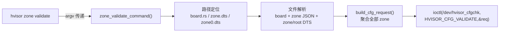
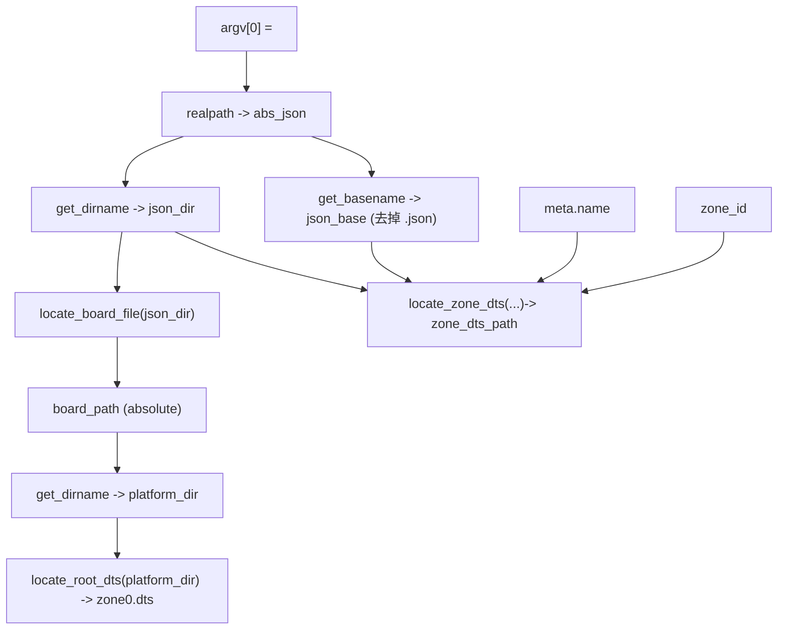
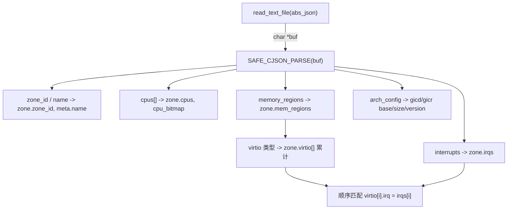
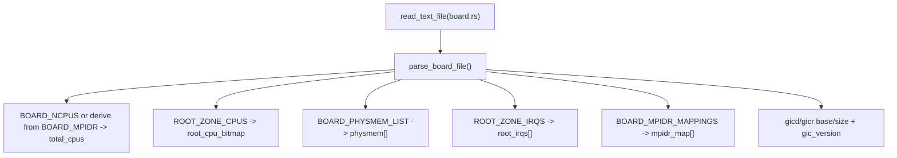
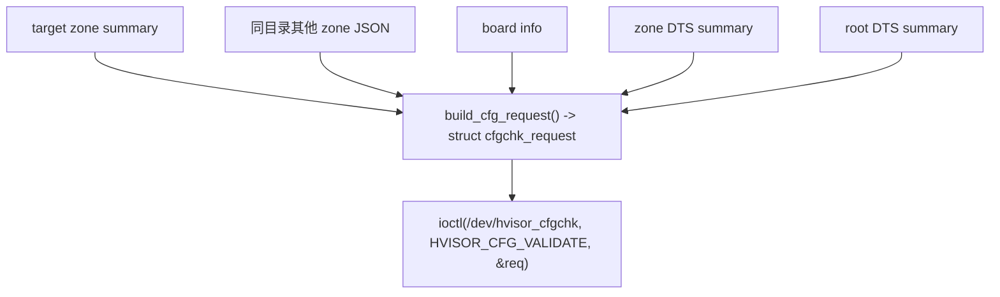

# hvisor `zone validate` 数据流 & 路径解析指南

> 关联源码：`tools/validate.c`, `tools/hvisor.c`, `include/cfgchk.h`
> 适用读者：希望深入理解配置校验（用户态解析 -> 内核校验）整个流程的开发者

---

## 1. 顶层调用链



1. `tools/hvisor.c` 在 `argv[1]=="zone"` 且 `argv[2]=="validate"` 时跳转到 `zone_validate_command(argc-3, &argv[3])`。
2. `zone_validate_command` 负责剩余的所有用户态工作：路径解析、文件解析、请求构建与 IOCTL。

---

## 2. 路径解析：如何定位 board/DTS

### 2.1 步骤概览



### 2.2 关键要点

- `realpath()`：统一绝对路径，避免目录遍历带来的歧义。
- `locate_board_file()`：从 `json_dir` 开始向父目录迭代查找 `board.rs`。一旦命中，通过 `ensure_realpath()` 获得最终路径。
- `locate_zone_dts()`：
  - 先尝试与 JSON 同目录的多个命名（`<json_base>.dts`、`<zone_name>.dts`、`zone<id>.dts`）。
  - 若失败则在 `platform_dir` 使用 `search_dts_with_hint()` 做模糊匹配，确保容错。
- `locate_root_dts()`：平台目录下固定的候选列表（`zone0.dts`、`image/zone0.dts`、`dts/zone0.dts`）。

当上述路径全部解析成功后，`zone_validate_command` 已经握有：

| 变量              | 含义                                    |
| ----------------- | --------------------------------------- |
| `abs_json`      | 目标 zone JSON 的绝对路径               |
| `board_path`    | 与 JSON 同平台的 `board.rs`           |
| `zone_dts_path` | 目标 zone 的 DTS                        |
| `root_dts_path` | 根区 (zone0) 的 DTS                     |
| `platform_dir`  | 平台根目录（board/DTS/JSON 的公共祖先） |

---

## 3. JSON -> `cfgchk_zone_summary`

### 3.1 结构体回顾

`include/cfgchk.h` 中的 `struct cfgchk_zone_summary` 包含：

- CPU：`cpus[]`, `cpu_bitmap`, `cpu_count`
- 内存：`mem_regions[]`（含 `type` 与 `flags`）
- IRQ：`irqs[]`, `irq_count`
- Virtio：`virtio[]`（base/size/irq）
- GIC：`gicd_*`, `gicr_*`, `gic_version`

### 3.2 解析流水线



1. `read_text_file()` 把 JSON 读入内存，`SAFE_CJSON_PARSE()` 转成 `cJSON` 树。
2. `zone_id` 与 `name`：
   - `zone->zone_id` 是后续查找 DTS 的主键。
   - `meta.name`（如果存在）用于 `locate_zone_dts()` 的名称匹配。
3. `cpus` 数组：
   - 逐项校验为数字；写入 `zone->cpus[i]`。
   - 同步维护 `zone->cpu_bitmap`（位图形式，用于快速检测 CPU 冲突）。
4. `memory_regions`：
   - `physical_start` / `size` 支持字符串（十六进制）或数字。
   - `type` 映射到 `CFGCHK_MEM_RAM / IO / VIRTIO`。
   - 当类型为 virtio 时，会额外在 `zone->virtio[]` 中增加条目。
5. `interrupts`：
   - 数组中的数值写入 `zone->irqs[]`。
   - 默认假设 virtio 设备的 IRQ 与列表顺序一致。
6. `arch_config`：
   - 解析 `gic_version` 字符串或数字。
   - `gicd_base/gicd_size/gicr_base/gicr_size` 统一转换为 64 位无符号整数。

JSON 解析结束后，`struct cfgchk_zone_summary` 完整反映了用户配置文件中的 CPU/内存/IRQ/virtio/GIC 信息。

---

## 4. board.rs -> `cfgchk_board_info`



- **CPU 总数**：`BOARD_NCPUS` 首选；解析失败时由 `BOARD_MPIDR_MAPPINGS` 的长度兜底。
- **根区 CPU 位图**：解析 `ROOT_ZONE_CPUS` 的位运算表达式（例如 `1 << 0 | 1 << 1`）并写入 `root_cpu_bitmap`。
- **物理内存**：`BOARD_PHYSMEM_LIST` 的 `(start, end, type)` 元组被装载到 `physmem[]`，并区分 RAM/IO。
- **根区 IRQ**：`ROOT_ZONE_IRQS` -> `root_irqs[]`，用于和 guest IRQ 冲突检测。
- **MPIDR 映射**：保存在 `mpidr_map[]`，后续 `parse_zone_dts()` 需要这个映射把 DTS 中的 MPIDR 转换成 CPU 索引。
- **GIC 参数**：`gicd_base/gicd_size/gicr_base/gicr_size/gic_version` 皆可选，若 `gic_version` 缺失则以是否存在 GICR 推断 v2/v3。

与此同时，`parse_root_dts()` 会把 root DTS 中 `reserved-memory` 里的 `reg = <base size>` 区段存入 `board->reserved_mem[]`，供下一步标记。

---

## 5. zone/root DTS 摘要 + reserved 标记

### 5.1 zone DTS (`parse_zone_dts`)

- `cpu@` 节点：读取 `reg = <MPIDR ...>`，用 `parse_reg_cells()` 拆分，再通过 `mpidr_to_cpu()` 根据 `board->mpidr_map[]` 得到 CPU 索引。
- `memory@`：`reg = <base size>` 解析为 `CFGCHK_MEM_RAM`。
- `virtio_mmio@`：记录 base/size，并从 `interrupts = <type irq>` 中提取 IRQ。

最终填充 `struct cfgchk_dts_summary dts_zone` 的 `cpus[] / mem_regions[] / virtio[]`。

### 5.2 root DTS (`parse_root_dts`)

- 定位 `reserved-memory` 块，收集所有 `reg = <base size>`。
- 每个区段既写入 `board->reserved_mem[]`，也追加到 `dts_root.mem_regions[]`，方便内核校验。

### 5.3 `apply_reservation_flags()`

- 遍历 `zone->mem_regions[]`，当某 RAM 区间完全落在 `board->reserved_mem[]` 中时，写入 `CFGCHK_MEM_F_REQUIRES_RESERVATION` 标志位。
- 该标记在 `struct cfgchk_mem_region.flags` 中体现，告知内核“此段内存需要在 root DTS 的 reserved-memory 中对应预留”。

---

## 6. `build_cfg_request()` 与 IOCTL



1. `build_cfg_request()` 先清空 `struct cfgchk_request req`，写入：
   - `req.version = CFGCHK_IOCTL_VERSION`
   - `req.board = board`
   - `req.dts_zone = dts_zone`
   - `req.dts_root = dts_root`
   - `req.zones[0] = target_zone`
2. 扫描 `json_dir`：
   - 对每个非目标 `.json` 再次调用 `parse_zone_json()` -> `apply_reservation_flags()`。
   - 追加到 `req.zones[]`，直到 `CFGCHK_MAX_ZONES`。
3. `zone_validate_command` 打开 `/dev/hvisor_cfgchk`，执行 `ioctl(fd, HVISOR_CFG_VALIDATE, &req)`。
4. IOCTL 成功即打印 `[OK] cfgchk validation success.`；失败时输出 errno 供排查。

最终结构体布局（内核态共享）如下：

```text
struct cfgchk_request {
    u32 version;
    u32 zone_count;
    u32 target_index;
    u32 flags;
    struct cfgchk_board_info board;
    struct cfgchk_zone_summary zones[CFGCHK_MAX_ZONES];
    struct cfgchk_dts_summary dts_zone;
    struct cfgchk_dts_summary dts_root;
};
```

---

## 7. 学习建议

1. **配合日志**：在 `parse_*` 函数中添加临时 `log_debug` 或 `printf`，观察结构体填充的具体数值。
2. **手动制造冲突**：例如让两个 JSON 使用相同 CPU 或重叠内存，运行 `zone validate` 查看错误提示，加深对校验规则的理解。
3. **内核侧对照**：阅读 `driver/cfgchk.c` 中的 `cfgchk_validate_request()`，理解内核如何消费 `struct cfgchk_request` 的各个字段。
4. **保持目录结构**：确保 `zone*.json`、`board.rs`、`*.dts` 位于同一平台目录树，便于 `locate_*` 系列函数自动发现。

---

通过本文的分解，你可以从“路径解析”到“数据结构演化”全面把握 `zone validate` 的工作方式，为调试和扩展配置校验能力打下坚实基础。
